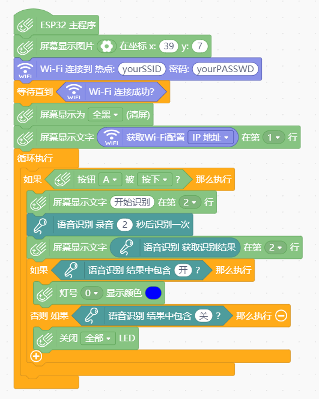
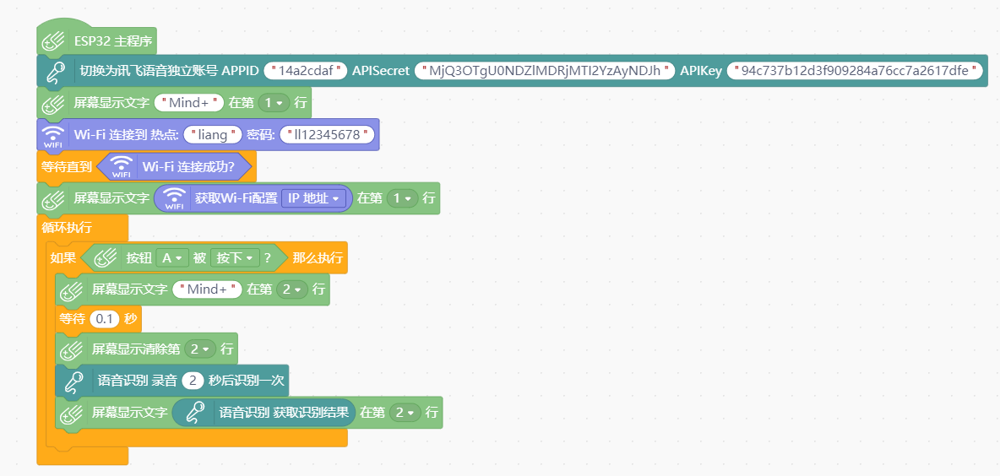
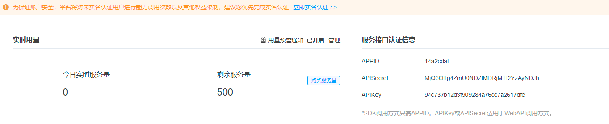

# ASR module WIFI语音识别


---------------------------------------------------------


## 链接
- **本用户库加载地址:** ```https://github.com/liliang9693/ext-mPythonASR```
- **Mind+下载地址：** [http://mindplus.cc](http://mindplus.cc "http://mindplus.cc")    
- **Mind+扩展库教程：** [https://mindplus.dfrobot.com.cn/extensions-user](https://mindplus.dfrobot.com.cn/extensions-user "https://mindplus.dfrobot.com.cn/extensions-user")    

## 简介

- **介绍：** 本扩展库实现掌控板2.0语音识别功能，需要使用掌控板2.0版硬件，需搭配WIFI扩展功能一起使用。  

## 积木


## 示例



# 讯飞语音账号获取流程
- 首先到讯飞开放平台注册并登录： https://www.xfyun.cn/
- 进入**控制台**，**创建应用**，点开创建的应用就可以得到**服务接口认证信息**也就是**APPID、APISecret、APIKey**，填入对应积木中即可。



## License

MIT

## 硬件支持

MCU                | JavaScript    | Arduino   | MicroPython    | Remarks
------------------ | :----------: | :----------: | :---------: | -----
micro:bit        |             |       x       |             | 
mpython        |             |        √      |             | 
arduino uno    |             |        x      |             | 
 

## 更新日志
- V0.1.0  20200220 第一版发布
- V0.2.0  20210402 根据最新规则修改文件目录，防止文件丢失
- V0.3.0  20211028 增加切换讯飞独立账号功能


